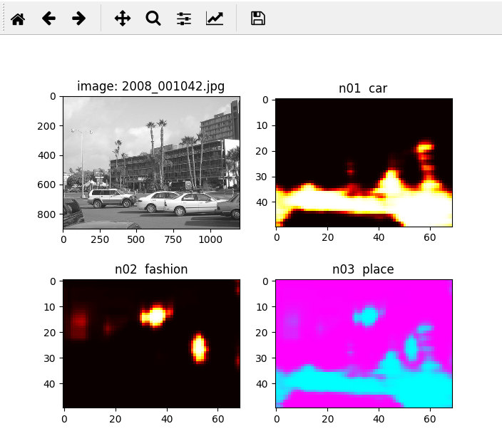

heatmaps.py  screenshot:

DataSet Images Directory:

...\places_train: 
  cars
  fashions
  places

...\places_test:
  cars
  fashions
  places

train caffemodel:

...\caffe-windows-opencl\hmprjs> python  lists_train.py
...\caffe-windows-opencl\hmprjs> python  lists_test.py
...\caffe-windows-opencl\hmprjs> create_gray_lmdb.cmd
...\caffe-windows-opencl\hmprjs> make_mean.cmd
...\caffe-windows-opencl\hmprjs> train_quick.cmd

heatmaps:
...\caffe-windows-opencl\hmprjs> python  heatmaps.py

