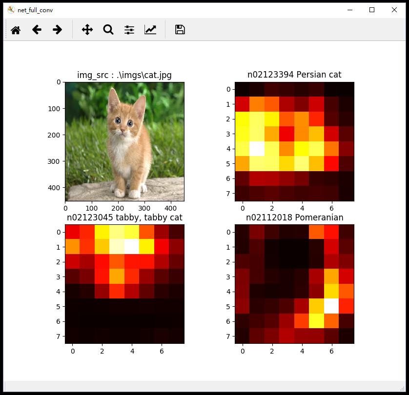

# CaffeNet Fully Convolutional Network (win10 mingw64 python)

win10 cmd console:

1. download caffe_net model binary

...> python get_caffenet_model_binary.py

2. run python script

...> python full_conv_mulit.py

